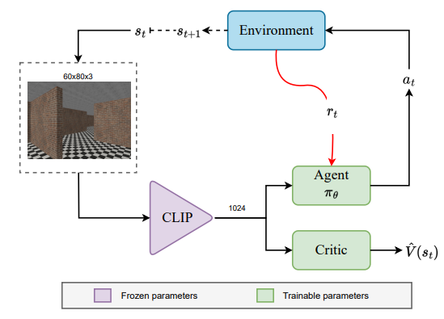

# Towards Clear Evaluation of Robotic Visual Semantic Navigation

This is the official code repository of the work described in our [ICARA 2023 paper](https://gram.web.uah.es/data/publications/icara2023-gutierrez.pdf). 
<p align="center">
  
</p>

The code provides the implementation of Miniworld Maze experiments.


It is a minimal fork from [pyRIL](https://github.com/SergioHdezG/pyRIL) library adapted for visual navigation. Please, visit the original repository if you want to find a comprehensive Reinforcement and Imitation Learning library.

## Installation

This code is only tested on Ubuntu machines with conda preinstalled. To create the environment, just run:

```shell
bash create_env.sh
```

## Usage

### Run training

To run the training process execute the following commands in your terminal: 

```shell
conda activate vsn
python launch_maze.py maze_experiments/maze_config.yaml
```

Basic parameters of the training are already set on [maze_config.yaml](maze_experiments/maze_config.yaml). Change them in order to meet your experiment requirements.

### Run evaluation

To run the evaluation process on the 100 test mazes execute the following commands in your terminal: 

```shell
conda activate vsn
python evaluator.py maze_experiments/maze_config.yaml
```

Be sure to select the same [maze_config.yaml](maze_experiments/maze_config.yaml) that you used during training. Introduce the checkpoint path in the config file to load the model you want to evaluate. To use our baseline, download it [from here](https://universidaddealcala-my.sharepoint.com/:u:/g/personal/gram_uah_es/ERUowTQbAvFHvCg5VJuzku8BeBrNx8kEizPpNiKVlRj8Mg?Download=1).
